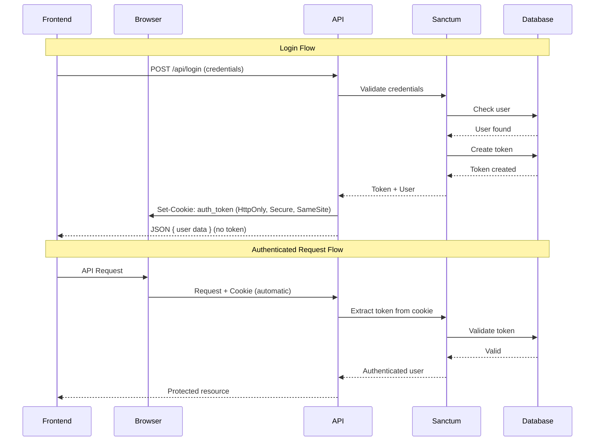

# Design Document: HTTP-Only Cookie Authentication

## Overview

This design implements secure HTTP-only cookie-based authentication for the Laravel API, replacing the current approach of returning tokens in JSON responses. The implementation leverages Laravel Sanctum's built-in SPA authentication capabilities while adding a custom cookie management layer for token-based API authentication.

The key security benefits include:
- **XSS Protection**: JavaScript cannot access HttpOnly cookies
- **Automatic Transmission**: Browser handles cookie sending
- **CSRF Protection**: SameSite attribute prevents cross-site attacks
- **HTTPS Enforcement**: Secure flag ensures encrypted transmission

## Architecture



## Components and Interfaces

### 1. CookieAuthService

A new service class responsible for managing authentication cookies.

```php
interface CookieAuthServiceInterface
{
    /**
     * Create an HTTP-only authentication cookie with the given token.
     */
    public function createAuthCookie(string $token, ?int $expirationMinutes = null): Cookie;
    
    /**
     * Create an expired cookie to clear authentication.
     */
    public function createExpiredAuthCookie(): Cookie;
    
    /**
     * Get cookie configuration from environment.
     */
    public function getCookieConfig(): array;
}
```

### 2. Modified AuthController

The existing AuthController will be modified to:
- Use CookieAuthService for cookie management
- Attach cookies to responses instead of returning tokens in JSON
- Handle token refresh with cookie updates

```php
// Login response modification
public function login(Request $request): JsonResponse
{
    // ... validation and authentication ...
    
    $token = $user->createToken('auth_token')->plainTextToken;
    $cookie = $this->cookieAuthService->createAuthCookie($token);
    
    return response()->json([
        'success' => true,
        'message' => 'Login successful.',
        'data' => ['user' => $user],
    ])->withCookie($cookie);
}
```

### 3. Custom Middleware: ExtractTokenFromCookie

Middleware to extract the token from the cookie and set it as a Bearer token for Sanctum authentication.

```php
class ExtractTokenFromCookie
{
    public function handle(Request $request, Closure $next)
    {
        $cookieName = config('cookie-auth.cookie_name', 'auth_token');
        
        if ($request->hasCookie($cookieName) && !$request->bearerToken()) {
            $token = $request->cookie($cookieName);
            $request->headers->set('Authorization', 'Bearer ' . $token);
        }
        
        return $next($request);
    }
}
```

### 4. Configuration File

New configuration file `config/cookie-auth.php`:

```php
return [
    'cookie_name' => env('AUTH_COOKIE_NAME', 'auth_token'),
    'cookie_domain' => env('AUTH_COOKIE_DOMAIN', null),
    'cookie_path' => env('AUTH_COOKIE_PATH', '/'),
    'cookie_secure' => env('AUTH_COOKIE_SECURE', true),
    'cookie_same_site' => env('AUTH_COOKIE_SAME_SITE', 'lax'),
    'cookie_http_only' => true, // Always true, not configurable
    'expiration_minutes' => env('AUTH_COOKIE_EXPIRATION', 60 * 24 * 7), // 7 days
];
```

## Data Models

No new database tables are required. The existing Sanctum `personal_access_tokens` table continues to store tokens.

### Cookie Structure

| Attribute | Value | Description |
|-----------|-------|-------------|
| Name | `auth_token` | Configurable via environment |
| Value | `{sanctum_token}` | The plain text Sanctum token |
| HttpOnly | `true` | Always enabled, prevents JS access |
| Secure | `true` (configurable) | HTTPS only in production |
| SameSite | `Lax` (configurable) | CSRF protection |
| Path | `/` | Sent with all requests |
| Domain | `null` (configurable) | Current domain by default |
| Expires | Token expiration | Matches token lifetime |

## Correctness Properties

*A property is a characteristic or behavior that should hold true across all valid executions of a system—essentially, a formal statement about what the system should do. Properties serve as the bridge between human-readable specifications and machine-verifiable correctness guarantees.*

### Property 1: Cookie Security Attributes

*For any* successful authentication response (login or register), the Set-Cookie header SHALL contain all required security attributes: HttpOnly flag, Secure flag (when configured), SameSite attribute, and Path="/".

**Validates: Requirements 1.1, 1.2, 1.3, 1.5**

### Property 2: Token in Cookie, Not in Response Body

*For any* successful authentication response (login or register), the authentication token SHALL be present in the Set-Cookie header AND SHALL NOT be present in the JSON response body.

**Validates: Requirements 2.1, 2.2, 2.4, 3.1, 3.2**

### Property 3: Failed Authentication Sets No Cookies

*For any* failed authentication attempt (invalid credentials or validation errors), the response SHALL NOT contain any Set-Cookie header for the auth token.

**Validates: Requirements 2.3, 3.3**

### Property 4: Logout Clears Cookie and Token

*For any* logout request, the response SHALL contain a Set-Cookie header with an expired timestamp AND the token SHALL be deleted from the database.

**Validates: Requirements 4.1, 4.2**

### Property 5: Cookie-Based Authentication Round Trip

*For any* valid authentication cookie, making a request to a protected endpoint SHALL successfully authenticate the user and return the expected protected resource.

**Validates: Requirements 5.1, 5.2**

### Property 6: Missing Cookie Returns 401

*For any* request to a protected endpoint without a valid authentication cookie, the response SHALL be 401 Unauthorized.

**Validates: Requirements 5.3**

### Property 7: CSRF Token Validation

*For any* state-changing request (POST, PUT, PATCH, DELETE) without a valid CSRF token, the response SHALL be 419 CSRF token mismatch.

**Validates: Requirements 6.2, 6.3**

### Property 8: Token Refresh Updates Cookie

*For any* successful token refresh request, the old token SHALL be invalidated AND a new token SHALL be set in the response cookie.

**Validates: Requirements 7.1, 7.2**

### Property 9: Invalid Token Refresh Returns 401

*For any* token refresh request with an invalid or expired token, the response SHALL be 401 Unauthorized.

**Validates: Requirements 7.3**

## Error Handling

| Scenario | HTTP Status | Response |
|----------|-------------|----------|
| Invalid credentials | 401 | `{"success": false, "message": "Invalid credentials"}` |
| Missing auth cookie | 401 | `{"message": "Unauthenticated"}` |
| Expired token | 401 | `{"message": "Unauthenticated"}` |
| Missing CSRF token | 419 | `{"message": "CSRF token mismatch"}` |
| Invalid CSRF token | 419 | `{"message": "CSRF token mismatch"}` |
| Validation errors | 422 | `{"message": "...", "errors": {...}}` |

## Testing Strategy

### Unit Tests

Unit tests will verify individual components in isolation:

1. **CookieAuthService Tests**
   - Cookie creation with correct attributes
   - Expired cookie creation
   - Configuration reading

2. **ExtractTokenFromCookie Middleware Tests**
   - Token extraction from cookie
   - Header setting when cookie present
   - No modification when bearer token exists

### Property-Based Tests

Property-based tests will use PHPUnit with data providers to test properties across multiple inputs:

**Testing Framework**: PHPUnit with Laravel's testing utilities

**Configuration**: Minimum 100 iterations per property test using data providers with randomized valid inputs.

**Tag Format**: `@group Feature: httponly-cookie-auth, Property {number}: {property_text}`

1. **Property 1 Test**: Generate random valid credentials, authenticate, verify all cookie attributes
2. **Property 2 Test**: Generate random valid users, authenticate, verify token location
3. **Property 3 Test**: Generate random invalid credentials, attempt auth, verify no cookies
4. **Property 4 Test**: Generate authenticated sessions, logout, verify cookie cleared and token deleted
5. **Property 5 Test**: Generate valid tokens, make protected requests, verify authentication
6. **Property 6 Test**: Generate protected endpoints, request without cookie, verify 401
7. **Property 7 Test**: Generate state-changing requests without CSRF, verify 419
8. **Property 8 Test**: Generate valid sessions, refresh, verify old token invalid and new cookie set
9. **Property 9 Test**: Generate invalid/expired tokens, attempt refresh, verify 401

### Integration Tests

Integration tests will verify the complete authentication flow:

1. Full login → authenticated request → logout flow
2. Registration → immediate authenticated access flow
3. Token refresh flow
4. CSRF protection flow with Sanctum
