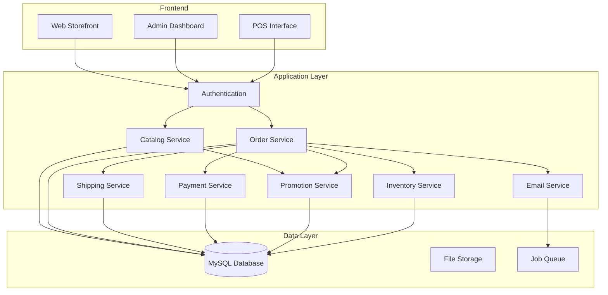
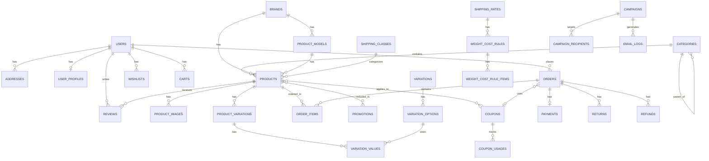

# Design Document: Shah Sports E-Commerce Platform

## Overview

This document outlines the technical design for converting the existing multi-vendor e-commerce platform into a single-vendor sports equipment store for Shah Sports. The design removes vendor-specific functionality and adds new features including manual POS, enhanced shipping with weight-based rules, targeted email campaigns, and comprehensive coupon management.

## Architecture

### High-Level Architecture



### Technology Stack

- **Framework**: Laravel 10.x (PHP 8.1+)
- **Database**: MySQL 8.0
- **Queue**: Laravel Queue with database driver
- **Email**: Laravel Mail with SMTP
- **Payment**: SSL Commerz / SSLWireless integration
- **PDF Generation**: DomPDF for invoices
- **Testing**: PHPUnit with Pest PHP for property-based testing

## Components and Interfaces

### 1. User Management Component

Handles authentication, authorization, and user profile management.

```php
interface UserServiceInterface
{
    public function register(array $data): User;
    public function authenticate(string $email, string $password): ?User;
    public function updateProfile(User $user, array $data): User;
    public function deactivate(User $user): bool;
    public function sendVerificationEmail(User $user): void;
    public function resetPassword(string $email): void;
}
```

### 2. Catalog Component

Manages products, categories, brands, and variations.

```php
interface CatalogServiceInterface
{
    public function createProduct(array $data): Product;
    public function updateProduct(Product $product, array $data): Product;
    public function getProductWithVariations(int $productId): Product;
    public function searchProducts(array $filters): LengthAwarePaginator;
    public function getProductsByCategory(int $categoryId): Collection;
    public function getProductsByBrand(int $brandId): Collection;
}

interface VariationServiceInterface
{
    public function createVariation(Product $product, array $options): ProductVariation;
    public function updateStock(ProductVariation $variation, int $quantity, string $reason): void;
    public function getAvailableOptions(Product $product): array;
}
```

### 3. Order Component

Handles order creation, status management, and POS functionality.

```php
interface OrderServiceInterface
{
    public function createOrder(User $user, Cart $cart, array $shippingData): Order;
    public function createPosOrder(array $customerData, array $items, ?float $discount): Order;
    public function updateStatus(Order $order, string $status): Order;
    public function cancelOrder(Order $order, string $reason): Order;
    public function getOrderHistory(User $user): Collection;
}
```

### 4. Shipping Component

Calculates shipping costs based on location, weight, and shipping class.

```php
interface ShippingServiceInterface
{
    public function calculateShippingCost(Cart $cart, Address $address): float;
    public function getAvailableMethods(Address $address): array;
    public function assignTrackingNumber(Order $order, string $trackingNumber): void;
    public function getShippingRates(string $city, string $state): array;
}
```

### 5. Promotion & Coupon Component

Manages promotions and coupon validation.

```php
interface PromotionServiceInterface
{
    public function getActivePromotions(): Collection;
    public function applyPromotion(Cart $cart): float;
    public function validateCoupon(string $code, User $user, Cart $cart): CouponValidationResult;
    public function applyCoupon(Cart $cart, Coupon $coupon): float;
    public function recordCouponUsage(Coupon $coupon, User $user, Order $order): void;
}
```

### 6. Inventory Component

Tracks stock levels and manages inventory adjustments.

```php
interface InventoryServiceInterface
{
    public function checkAvailability(Product $product, int $quantity): bool;
    public function reserveStock(OrderItem $item): void;
    public function releaseStock(OrderItem $item): void;
    public function adjustStock(Product $product, int $adjustment, string $reason): void;
    public function getLowStockProducts(int $threshold): Collection;
}
```

### 7. Email Marketing Component

Handles campaign creation and targeted email delivery.

```php
interface CampaignServiceInterface
{
    public function createCampaign(array $data): Campaign;
    public function getTargetCustomers(Campaign $campaign): Collection;
    public function sendCampaign(Campaign $campaign): void;
    public function trackEmailOpen(string $trackingId): void;
    public function getCampaignStats(Campaign $campaign): array;
}
```

## Data Models

### Entity Relationship Diagram



### Database Schema Changes

#### Users Table (Modified)
```sql
CREATE TABLE users (
    id BIGINT UNSIGNED AUTO_INCREMENT PRIMARY KEY,
    first_name VARCHAR(255) NOT NULL,
    last_name VARCHAR(255) NOT NULL,
    email VARCHAR(255) UNIQUE NOT NULL,
    phone VARCHAR(20) NULL,
    user_type ENUM('admin', 'customer') DEFAULT 'customer',
    email_verified_at TIMESTAMP NULL,
    password VARCHAR(255) NOT NULL,
    status BOOLEAN DEFAULT TRUE,
    remember_token VARCHAR(100) NULL,
    created_at TIMESTAMP NULL,
    updated_at TIMESTAMP NULL
);
```

#### Categories Table (Modified)
```sql
CREATE TABLE categories (
    id BIGINT UNSIGNED AUTO_INCREMENT PRIMARY KEY,
    parent_id BIGINT UNSIGNED NULL,
    name VARCHAR(255) NOT NULL,
    slug VARCHAR(255) UNIQUE NOT NULL,
    description TEXT NULL,
    image VARCHAR(255) NULL,
    sort_order INT DEFAULT 0,
    is_active BOOLEAN DEFAULT TRUE,
    meta_title VARCHAR(255) NULL,
    meta_description TEXT NULL,
    created_at TIMESTAMP NULL,
    updated_at TIMESTAMP NULL,
    FOREIGN KEY (parent_id) REFERENCES categories(id) ON DELETE SET NULL
);
```

#### Products Table (Modified - Removed vendor references)
```sql
CREATE TABLE products (
    id BIGINT UNSIGNED AUTO_INCREMENT PRIMARY KEY,
    category_id BIGINT UNSIGNED NOT NULL,
    brand_id BIGINT UNSIGNED NULL,
    model_id BIGINT UNSIGNED NULL,
    shipping_class_id BIGINT UNSIGNED NULL,
    name VARCHAR(255) NOT NULL,
    slug VARCHAR(255) UNIQUE NOT NULL,
    sku VARCHAR(100) UNIQUE NOT NULL,
    short_description TEXT NULL,
    description LONGTEXT NULL,
    price DECIMAL(10,2) NOT NULL,
    compare_price DECIMAL(10,2) NULL,
    cost_price DECIMAL(10,2) NULL,
    quantity INT DEFAULT 0,
    low_stock_threshold INT DEFAULT 5,
    weight DECIMAL(8,2) NULL,
    weight_unit ENUM('g', 'kg', 'lb') DEFAULT 'kg',
    length DECIMAL(8,2) NULL,
    width DECIMAL(8,2) NULL,
    height DECIMAL(8,2) NULL,
    is_featured BOOLEAN DEFAULT FALSE,
    is_trending BOOLEAN DEFAULT FALSE,
    status ENUM('active', 'inactive', 'draft') DEFAULT 'draft',
    meta_title VARCHAR(255) NULL,
    meta_description TEXT NULL,
    meta_keywords VARCHAR(255) NULL,
    created_at TIMESTAMP NULL,
    updated_at TIMESTAMP NULL,
    FOREIGN KEY (category_id) REFERENCES categories(id) ON DELETE CASCADE,
    FOREIGN KEY (brand_id) REFERENCES brands(id) ON DELETE SET NULL,
    FOREIGN KEY (model_id) REFERENCES product_models(id) ON DELETE SET NULL,
    FOREIGN KEY (shipping_class_id) REFERENCES shipping_classes(id) ON DELETE SET NULL
);
```

#### Product Variations Table (New)
```sql
CREATE TABLE product_variations (
    id BIGINT UNSIGNED AUTO_INCREMENT PRIMARY KEY,
    product_id BIGINT UNSIGNED NOT NULL,
    sku VARCHAR(100) UNIQUE NOT NULL,
    price DECIMAL(10,2) NULL,
    quantity INT DEFAULT 0,
    is_default BOOLEAN DEFAULT FALSE,
    created_at TIMESTAMP NULL,
    updated_at TIMESTAMP NULL,
    FOREIGN KEY (product_id) REFERENCES products(id) ON DELETE CASCADE
);

CREATE TABLE variation_values (
    id BIGINT UNSIGNED AUTO_INCREMENT PRIMARY KEY,
    product_variation_id BIGINT UNSIGNED NOT NULL,
    variation_option_id BIGINT UNSIGNED NOT NULL,
    created_at TIMESTAMP NULL,
    updated_at TIMESTAMP NULL,
    FOREIGN KEY (product_variation_id) REFERENCES product_variations(id) ON DELETE CASCADE,
    FOREIGN KEY (variation_option_id) REFERENCES variation_options(id) ON DELETE CASCADE
);
```

#### Brands Table (Modified - Removed shop reference)
```sql
CREATE TABLE brands (
    id BIGINT UNSIGNED AUTO_INCREMENT PRIMARY KEY,
    name VARCHAR(255) NOT NULL,
    slug VARCHAR(255) UNIQUE NOT NULL,
    logo VARCHAR(255) NULL,
    description TEXT NULL,
    sort_order INT DEFAULT 0,
    is_active BOOLEAN DEFAULT TRUE,
    created_at TIMESTAMP NULL,
    updated_at TIMESTAMP NULL
);
```

#### Product Models Table (Modified)
```sql
CREATE TABLE product_models (
    id BIGINT UNSIGNED AUTO_INCREMENT PRIMARY KEY,
    brand_id BIGINT UNSIGNED NOT NULL,
    name VARCHAR(255) NOT NULL,
    created_at TIMESTAMP NULL,
    updated_at TIMESTAMP NULL,
    FOREIGN KEY (brand_id) REFERENCES brands(id) ON DELETE CASCADE
);
```

#### Shipping Classes Table (New)
```sql
CREATE TABLE shipping_classes (
    id BIGINT UNSIGNED AUTO_INCREMENT PRIMARY KEY,
    name VARCHAR(255) NOT NULL,
    slug VARCHAR(255) UNIQUE NOT NULL,
    description TEXT NULL,
    created_at TIMESTAMP NULL,
    updated_at TIMESTAMP NULL
);
```

#### Shipping Rates Table (Modified)
```sql
CREATE TABLE shipping_rates (
    id BIGINT UNSIGNED AUTO_INCREMENT PRIMARY KEY,
    name VARCHAR(255) NOT NULL,
    shipping_class_id BIGINT UNSIGNED NULL,
    method ENUM('shah_sports_team', 'pathao_courier') NOT NULL,
    country VARCHAR(100) DEFAULT 'Bangladesh',
    delivery_time VARCHAR(100) NULL,
    free_shipping_min_order DECIMAL(10,2) DEFAULT 0,
    base_cost DECIMAL(10,2) DEFAULT 0,
    is_active BOOLEAN DEFAULT TRUE,
    created_at TIMESTAMP NULL,
    updated_at TIMESTAMP NULL,
    FOREIGN KEY (shipping_class_id) REFERENCES shipping_classes(id) ON DELETE SET NULL
);
```

#### Orders Table (Modified)
```sql
CREATE TABLE orders (
    id BIGINT UNSIGNED AUTO_INCREMENT PRIMARY KEY,
    user_id BIGINT UNSIGNED NULL,
    order_number VARCHAR(50) UNIQUE NOT NULL,
    order_type ENUM('online', 'in_store') DEFAULT 'online',
    shipping_address_id BIGINT UNSIGNED NULL,
    billing_address_id BIGINT UNSIGNED NULL,
    subtotal DECIMAL(10,2) NOT NULL,
    shipping_cost DECIMAL(10,2) DEFAULT 0,
    discount_amount DECIMAL(10,2) DEFAULT 0,
    tax_amount DECIMAL(10,2) DEFAULT 0,
    total_amount DECIMAL(10,2) NOT NULL,
    coupon_id BIGINT UNSIGNED NULL,
    shipping_method ENUM('shah_sports_team', 'pathao_courier') NULL,
    tracking_number VARCHAR(255) NULL,
    status ENUM('pending', 'confirmed', 'processing', 'shipped', 'delivered', 'cancelled', 'return_requested', 'return_approved', 'refunded') DEFAULT 'pending',
    payment_status ENUM('pending', 'paid', 'failed', 'refunded') DEFAULT 'pending',
    notes TEXT NULL,
    customer_name VARCHAR(255) NULL,
    customer_email VARCHAR(255) NULL,
    customer_phone VARCHAR(20) NULL,
    created_at TIMESTAMP NULL,
    updated_at TIMESTAMP NULL,
    FOREIGN KEY (user_id) REFERENCES users(id) ON DELETE SET NULL,
    FOREIGN KEY (shipping_address_id) REFERENCES addresses(id) ON DELETE SET NULL,
    FOREIGN KEY (billing_address_id) REFERENCES addresses(id) ON DELETE SET NULL,
    FOREIGN KEY (coupon_id) REFERENCES coupons(id) ON DELETE SET NULL
);
```

#### Order Items Table (Modified - Removed vendor reference)
```sql
CREATE TABLE order_items (
    id BIGINT UNSIGNED AUTO_INCREMENT PRIMARY KEY,
    order_id BIGINT UNSIGNED NOT NULL,
    product_id BIGINT UNSIGNED NOT NULL,
    product_variation_id BIGINT UNSIGNED NULL,
    product_name VARCHAR(255) NOT NULL,
    variation_details JSON NULL,
    quantity INT NOT NULL,
    unit_price DECIMAL(10,2) NOT NULL,
    total_price DECIMAL(10,2) NOT NULL,
    created_at TIMESTAMP NULL,
    updated_at TIMESTAMP NULL,
    FOREIGN KEY (order_id) REFERENCES orders(id) ON DELETE CASCADE,
    FOREIGN KEY (product_id) REFERENCES products(id) ON DELETE CASCADE,
    FOREIGN KEY (product_variation_id) REFERENCES product_variations(id) ON DELETE SET NULL
);
```

#### Coupons Table (New)
```sql
CREATE TABLE coupons (
    id BIGINT UNSIGNED AUTO_INCREMENT PRIMARY KEY,
    code VARCHAR(50) UNIQUE NOT NULL,
    name VARCHAR(255) NOT NULL,
    description TEXT NULL,
    discount_type ENUM('percentage', 'fixed_amount', 'free_shipping') NOT NULL,
    discount_value DECIMAL(10,2) NOT NULL,
    min_order_amount DECIMAL(10,2) DEFAULT 0,
    max_discount_amount DECIMAL(10,2) NULL,
    applies_to ENUM('all_products', 'specific_products', 'specific_brands', 'specific_categories') DEFAULT 'all_products',
    usage_limit INT NULL,
    usage_count INT DEFAULT 0,
    once_per_customer BOOLEAN DEFAULT TRUE,
    starts_at TIMESTAMP NULL,
    expires_at TIMESTAMP NULL,
    is_active BOOLEAN DEFAULT TRUE,
    created_at TIMESTAMP NULL,
    updated_at TIMESTAMP NULL
);

CREATE TABLE coupon_products (
    coupon_id BIGINT UNSIGNED NOT NULL,
    product_id BIGINT UNSIGNED NOT NULL,
    PRIMARY KEY (coupon_id, product_id),
    FOREIGN KEY (coupon_id) REFERENCES coupons(id) ON DELETE CASCADE,
    FOREIGN KEY (product_id) REFERENCES products(id) ON DELETE CASCADE
);

CREATE TABLE coupon_brands (
    coupon_id BIGINT UNSIGNED NOT NULL,
    brand_id BIGINT UNSIGNED NOT NULL,
    PRIMARY KEY (coupon_id, brand_id),
    FOREIGN KEY (coupon_id) REFERENCES coupons(id) ON DELETE CASCADE,
    FOREIGN KEY (brand_id) REFERENCES brands(id) ON DELETE CASCADE
);

CREATE TABLE coupon_categories (
    coupon_id BIGINT UNSIGNED NOT NULL,
    category_id BIGINT UNSIGNED NOT NULL,
    PRIMARY KEY (coupon_id, category_id),
    FOREIGN KEY (coupon_id) REFERENCES coupons(id) ON DELETE CASCADE,
    FOREIGN KEY (category_id) REFERENCES categories(id) ON DELETE CASCADE
);

CREATE TABLE coupon_usages (
    id BIGINT UNSIGNED AUTO_INCREMENT PRIMARY KEY,
    coupon_id BIGINT UNSIGNED NOT NULL,
    user_id BIGINT UNSIGNED NULL,
    order_id BIGINT UNSIGNED NOT NULL,
    customer_email VARCHAR(255) NOT NULL,
    discount_applied DECIMAL(10,2) NOT NULL,
    created_at TIMESTAMP NULL,
    FOREIGN KEY (coupon_id) REFERENCES coupons(id) ON DELETE CASCADE,
    FOREIGN KEY (user_id) REFERENCES users(id) ON DELETE SET NULL,
    FOREIGN KEY (order_id) REFERENCES orders(id) ON DELETE CASCADE
);
```

#### Promotions Table (Modified)
```sql
CREATE TABLE promotions (
    id BIGINT UNSIGNED AUTO_INCREMENT PRIMARY KEY,
    name VARCHAR(255) NOT NULL,
    description TEXT NULL,
    promotion_type ENUM('percentage', 'fixed_amount', 'flash_sale', 'combo_offer', 'free_delivery') NOT NULL,
    discount_value DECIMAL(10,2) NOT NULL,
    applies_to ENUM('all_products', 'specific_products', 'specific_brands', 'specific_categories') DEFAULT 'all_products',
    apply_level ENUM('product', 'cart') DEFAULT 'product',
    min_purchase_amount DECIMAL(10,2) DEFAULT 0,
    max_discount_amount DECIMAL(10,2) NULL,
    starts_at TIMESTAMP NOT NULL,
    ends_at TIMESTAMP NOT NULL,
    is_active BOOLEAN DEFAULT TRUE,
    priority INT DEFAULT 0,
    created_at TIMESTAMP NULL,
    updated_at TIMESTAMP NULL
);

CREATE TABLE promotion_products (
    promotion_id BIGINT UNSIGNED NOT NULL,
    product_id BIGINT UNSIGNED NOT NULL,
    PRIMARY KEY (promotion_id, product_id),
    FOREIGN KEY (promotion_id) REFERENCES promotions(id) ON DELETE CASCADE,
    FOREIGN KEY (product_id) REFERENCES products(id) ON DELETE CASCADE
);

CREATE TABLE promotion_brands (
    promotion_id BIGINT UNSIGNED NOT NULL,
    brand_id BIGINT UNSIGNED NOT NULL,
    PRIMARY KEY (promotion_id, brand_id),
    FOREIGN KEY (promotion_id) REFERENCES promotions(id) ON DELETE CASCADE,
    FOREIGN KEY (brand_id) REFERENCES brands(id) ON DELETE CASCADE
);

CREATE TABLE promotion_categories (
    promotion_id BIGINT UNSIGNED NOT NULL,
    category_id BIGINT UNSIGNED NOT NULL,
    PRIMARY KEY (promotion_id, category_id),
    FOREIGN KEY (promotion_id) REFERENCES promotions(id) ON DELETE CASCADE,
    FOREIGN KEY (category_id) REFERENCES categories(id) ON DELETE CASCADE
);
```

#### Campaigns Table (New)
```sql
CREATE TABLE campaigns (
    id BIGINT UNSIGNED AUTO_INCREMENT PRIMARY KEY,
    name VARCHAR(255) NOT NULL,
    subject VARCHAR(255) NOT NULL,
    content LONGTEXT NOT NULL,
    campaign_type ENUM('promotional', 'abandoned_cart', 'order_update', 'newsletter') NOT NULL,
    target_type ENUM('all_customers', 'specific_customers', 'customer_group') DEFAULT 'all_customers',
    target_criteria JSON NULL,
    scheduled_at TIMESTAMP NULL,
    sent_at TIMESTAMP NULL,
    status ENUM('draft', 'scheduled', 'sending', 'sent', 'cancelled') DEFAULT 'draft',
    total_recipients INT DEFAULT 0,
    total_sent INT DEFAULT 0,
    total_opened INT DEFAULT 0,
    total_clicked INT DEFAULT 0,
    created_at TIMESTAMP NULL,
    updated_at TIMESTAMP NULL
);

CREATE TABLE campaign_recipients (
    id BIGINT UNSIGNED AUTO_INCREMENT PRIMARY KEY,
    campaign_id BIGINT UNSIGNED NOT NULL,
    user_id BIGINT UNSIGNED NULL,
    email VARCHAR(255) NOT NULL,
    status ENUM('pending', 'sent', 'opened', 'clicked', 'bounced') DEFAULT 'pending',
    sent_at TIMESTAMP NULL,
    opened_at TIMESTAMP NULL,
    clicked_at TIMESTAMP NULL,
    created_at TIMESTAMP NULL,
    FOREIGN KEY (campaign_id) REFERENCES campaigns(id) ON DELETE CASCADE,
    FOREIGN KEY (user_id) REFERENCES users(id) ON DELETE SET NULL
);
```

#### Inventory Logs Table (New)
```sql
CREATE TABLE inventory_logs (
    id BIGINT UNSIGNED AUTO_INCREMENT PRIMARY KEY,
    product_id BIGINT UNSIGNED NOT NULL,
    product_variation_id BIGINT UNSIGNED NULL,
    quantity_before INT NOT NULL,
    quantity_change INT NOT NULL,
    quantity_after INT NOT NULL,
    reason ENUM('sale', 'return', 'adjustment', 'restock', 'damage', 'pos_sale') NOT NULL,
    reference_type VARCHAR(50) NULL,
    reference_id BIGINT UNSIGNED NULL,
    notes TEXT NULL,
    created_by BIGINT UNSIGNED NULL,
    created_at TIMESTAMP NULL,
    FOREIGN KEY (product_id) REFERENCES products(id) ON DELETE CASCADE,
    FOREIGN KEY (product_variation_id) REFERENCES product_variations(id) ON DELETE SET NULL,
    FOREIGN KEY (created_by) REFERENCES users(id) ON DELETE SET NULL
);
```

#### Reviews Table (Modified - Removed shop reference)
```sql
CREATE TABLE reviews (
    id BIGINT UNSIGNED AUTO_INCREMENT PRIMARY KEY,
    user_id BIGINT UNSIGNED NOT NULL,
    product_id BIGINT UNSIGNED NOT NULL,
    order_id BIGINT UNSIGNED NOT NULL,
    rating TINYINT NOT NULL CHECK (rating >= 1 AND rating <= 5),
    title VARCHAR(255) NULL,
    comment TEXT NULL,
    helpful_count INT DEFAULT 0,
    status ENUM('pending', 'approved', 'rejected') DEFAULT 'pending',
    admin_response TEXT NULL,
    created_at TIMESTAMP NULL,
    updated_at TIMESTAMP NULL,
    FOREIGN KEY (user_id) REFERENCES users(id) ON DELETE CASCADE,
    FOREIGN KEY (product_id) REFERENCES products(id) ON DELETE CASCADE,
    FOREIGN KEY (order_id) REFERENCES orders(id) ON DELETE CASCADE
);

CREATE TABLE review_helpful (
    user_id BIGINT UNSIGNED NOT NULL,
    review_id BIGINT UNSIGNED NOT NULL,
    PRIMARY KEY (user_id, review_id),
    FOREIGN KEY (user_id) REFERENCES users(id) ON DELETE CASCADE,
    FOREIGN KEY (review_id) REFERENCES reviews(id) ON DELETE CASCADE
);
```

#### Returns Table (Modified)
```sql
CREATE TABLE returns (
    id BIGINT UNSIGNED AUTO_INCREMENT PRIMARY KEY,
    order_id BIGINT UNSIGNED NOT NULL,
    order_item_id BIGINT UNSIGNED NOT NULL,
    user_id BIGINT UNSIGNED NOT NULL,
    quantity INT NOT NULL,
    reason ENUM('defective', 'wrong_item', 'not_as_described', 'changed_mind', 'other') NOT NULL,
    reason_details TEXT NULL,
    status ENUM('requested', 'approved', 'rejected', 'received', 'processed') DEFAULT 'requested',
    admin_notes TEXT NULL,
    created_at TIMESTAMP NULL,
    updated_at TIMESTAMP NULL,
    FOREIGN KEY (order_id) REFERENCES orders(id) ON DELETE CASCADE,
    FOREIGN KEY (order_item_id) REFERENCES order_items(id) ON DELETE CASCADE,
    FOREIGN KEY (user_id) REFERENCES users(id) ON DELETE CASCADE
);
```

#### Refunds Table (Modified)
```sql
CREATE TABLE refunds (
    id BIGINT UNSIGNED AUTO_INCREMENT PRIMARY KEY,
    order_id BIGINT UNSIGNED NOT NULL,
    return_id BIGINT UNSIGNED NULL,
    user_id BIGINT UNSIGNED NOT NULL,
    amount DECIMAL(10,2) NOT NULL,
    refund_type ENUM('full', 'partial') NOT NULL,
    refund_method ENUM('original_payment', 'store_credit', 'bank_transfer') DEFAULT 'original_payment',
    status ENUM('pending', 'processing', 'completed', 'failed') DEFAULT 'pending',
    transaction_id VARCHAR(255) NULL,
    notes TEXT NULL,
    processed_at TIMESTAMP NULL,
    created_at TIMESTAMP NULL,
    updated_at TIMESTAMP NULL,
    FOREIGN KEY (order_id) REFERENCES orders(id) ON DELETE CASCADE,
    FOREIGN KEY (return_id) REFERENCES returns(id) ON DELETE SET NULL,
    FOREIGN KEY (user_id) REFERENCES users(id) ON DELETE CASCADE
);
```

#### Store Policies Table (Modified - Removed shop reference)
```sql
CREATE TABLE store_policies (
    id BIGINT UNSIGNED AUTO_INCREMENT PRIMARY KEY,
    policy_type ENUM('shipping', 'return_refund', 'privacy', 'terms', 'warranty') NOT NULL,
    title VARCHAR(255) NOT NULL,
    slug VARCHAR(255) UNIQUE NOT NULL,
    content LONGTEXT NOT NULL,
    is_active BOOLEAN DEFAULT TRUE,
    created_at TIMESTAMP NULL,
    updated_at TIMESTAMP NULL
);
```

#### CMS Pages Table (New)
```sql
CREATE TABLE cms_pages (
    id BIGINT UNSIGNED AUTO_INCREMENT PRIMARY KEY,
    title VARCHAR(255) NOT NULL,
    slug VARCHAR(255) UNIQUE NOT NULL,
    content LONGTEXT NOT NULL,
    meta_title VARCHAR(255) NULL,
    meta_description TEXT NULL,
    is_active BOOLEAN DEFAULT TRUE,
    created_at TIMESTAMP NULL,
    updated_at TIMESTAMP NULL
);
```

#### Banners Table (Modified)
```sql
CREATE TABLE banners (
    id BIGINT UNSIGNED AUTO_INCREMENT PRIMARY KEY,
    title VARCHAR(255) NOT NULL,
    subtitle VARCHAR(255) NULL,
    image VARCHAR(255) NOT NULL,
    link VARCHAR(255) NULL,
    button_text VARCHAR(100) NULL,
    position ENUM('homepage_hero', 'homepage_secondary', 'category_page', 'sidebar') DEFAULT 'homepage_hero',
    sort_order INT DEFAULT 0,
    starts_at TIMESTAMP NULL,
    ends_at TIMESTAMP NULL,
    is_active BOOLEAN DEFAULT TRUE,
    created_at TIMESTAMP NULL,
    updated_at TIMESTAMP NULL
);
```

#### Invoices Table (New)
```sql
CREATE TABLE invoices (
    id BIGINT UNSIGNED AUTO_INCREMENT PRIMARY KEY,
    order_id BIGINT UNSIGNED NOT NULL,
    invoice_number VARCHAR(50) UNIQUE NOT NULL,
    invoice_date DATE NOT NULL,
    due_date DATE NULL,
    subtotal DECIMAL(10,2) NOT NULL,
    shipping_cost DECIMAL(10,2) DEFAULT 0,
    discount_amount DECIMAL(10,2) DEFAULT 0,
    tax_amount DECIMAL(10,2) DEFAULT 0,
    total_amount DECIMAL(10,2) NOT NULL,
    notes TEXT NULL,
    pdf_path VARCHAR(255) NULL,
    created_at TIMESTAMP NULL,
    updated_at TIMESTAMP NULL,
    FOREIGN KEY (order_id) REFERENCES orders(id) ON DELETE CASCADE
);
```

#### Payments Table (Modified)
```sql
CREATE TABLE payments (
    id BIGINT UNSIGNED AUTO_INCREMENT PRIMARY KEY,
    order_id BIGINT UNSIGNED NOT NULL,
    user_id BIGINT UNSIGNED NULL,
    amount DECIMAL(10,2) NOT NULL,
    currency VARCHAR(10) DEFAULT 'BDT',
    payment_method ENUM('ssl_commerz', 'bkash', 'nagad', 'cash_on_delivery', 'manual', 'bank_transfer') NOT NULL,
    transaction_id VARCHAR(255) NULL,
    gateway_response JSON NULL,
    status ENUM('pending', 'completed', 'failed', 'refunded') DEFAULT 'pending',
    paid_at TIMESTAMP NULL,
    created_at TIMESTAMP NULL,
    updated_at TIMESTAMP NULL,
    FOREIGN KEY (order_id) REFERENCES orders(id) ON DELETE CASCADE,
    FOREIGN KEY (user_id) REFERENCES users(id) ON DELETE SET NULL
);
```


## Correctness Properties

*A property is a characteristic or behavior that should hold true across all valid executions of a system—essentially, a formal statement about what the system should do. Properties serve as the bridge between human-readable specifications and machine-verifiable correctness guarantees.*

### Property 1: User Role Restriction
*For any* user in the system, the user_type field SHALL only contain values 'admin' or 'customer'.
**Validates: Requirements 1.1**

### Property 2: User Registration Validation
*For any* registration attempt, if name, email, password, or phone is missing or invalid, the registration SHALL be rejected and no user record created.
**Validates: Requirements 1.2**

### Property 3: Authentication Correctness
*For any* login attempt with valid credentials, the system SHALL create a session; for invalid credentials, no session SHALL be created.
**Validates: Requirements 1.5**

### Property 4: Category Hierarchy Integrity
*For any* category with a parent_id, the referenced parent category SHALL exist in the database, and circular references SHALL be prevented.
**Validates: Requirements 2.1**

### Property 5: Category Deletion Cascade
*For any* category deletion, all products in that category SHALL either be reassigned or handled according to cascade rules (no orphaned products).
**Validates: Requirements 2.4**

### Property 6: Product Required Fields
*For any* product creation, if name, SKU, price, description, or category_id is missing, the creation SHALL be rejected.
**Validates: Requirements 3.1**

### Property 7: Product Variation Inventory Independence
*For any* product with variations, each variation SHALL have its own independent quantity field, and updating one variation's stock SHALL NOT affect other variations.
**Validates: Requirements 3.2, 3.3**

### Property 8: Inactive Product Visibility
*For any* product with status 'inactive' or 'draft', the product SHALL NOT appear in public storefront queries.
**Validates: Requirements 3.6**

### Property 9: Brand-Model Relationship
*For any* product model, it SHALL have a valid brand_id reference, and deleting a brand SHALL cascade to its models.
**Validates: Requirements 4.3**

### Property 10: Inventory Order Relationship
*For any* order placement (online or POS), the inventory quantity for each ordered item SHALL decrease by the ordered quantity; for any order cancellation or return completion, inventory SHALL be restored.
**Validates: Requirements 5.3, 5.4, 8.7, 12.6**

### Property 11: Low Stock Threshold Alert
*For any* product or variation where quantity falls to or below low_stock_threshold, a notification SHALL be generated.
**Validates: Requirements 5.2**

### Property 12: Inventory Adjustment Audit
*For any* manual inventory adjustment, an inventory_log record SHALL be created with quantity_before, quantity_change, quantity_after, and reason.
**Validates: Requirements 5.5**

### Property 13: Stock Status Calculation
*For any* product, if quantity > low_stock_threshold then status is 'in_stock', if quantity > 0 and quantity <= low_stock_threshold then status is 'low_stock', if quantity = 0 then status is 'out_of_stock'.
**Validates: Requirements 5.6**

### Property 14: Shipping Cost Calculation
*For any* cart and address combination, the shipping cost SHALL be calculated based on the sum of (product weight × quantity) and the applicable weight-based rules for the destination.
**Validates: Requirements 6.2, 6.4**

### Property 15: Free Shipping Application
*For any* order where subtotal >= free_shipping_min_order for the applicable shipping rate, shipping_cost SHALL be 0.
**Validates: Requirements 6.6**

### Property 16: Order Total Calculation
*For any* order, total_amount SHALL equal (subtotal + shipping_cost + tax_amount - discount_amount), and this invariant SHALL hold after any modification.
**Validates: Requirements 7.5**

### Property 17: Order Number Uniqueness
*For any* two orders in the system, their order_number values SHALL be different.
**Validates: Requirements 7.4**

### Property 18: Order Status Notification
*For any* order status change, an email notification job SHALL be dispatched to the customer.
**Validates: Requirements 7.3**

### Property 19: POS Order Marking
*For any* order created through POS, order_type SHALL be 'in_store' and payment_method SHALL be 'manual'.
**Validates: Requirements 8.4**

### Property 20: POS Invoice Generation
*For any* completed POS order, an invoice record SHALL be created with matching order details.
**Validates: Requirements 8.5**

### Property 21: Promotion Type Calculation
*For any* promotion, the discount SHALL be calculated correctly based on type: percentage applies percentage to eligible amount, fixed_amount subtracts fixed value, free_delivery sets shipping to 0.
**Validates: Requirements 9.1**

### Property 22: Promotion Non-Stacking
*For any* cart with multiple applicable promotions, only the highest-priority (or best-value) promotion SHALL be applied.
**Validates: Requirements 9.3**

### Property 23: Promotion Date Validity
*For any* promotion, it SHALL only apply when current_date >= starts_at AND current_date <= ends_at.
**Validates: Requirements 9.4**

### Property 24: Coupon Single Use Per Email
*For any* coupon with once_per_customer = true, if a coupon_usage record exists for that coupon and email, subsequent applications SHALL be rejected.
**Validates: Requirements 10.3**

### Property 25: Coupon Expiration Validation
*For any* coupon application attempt, if current_date > expires_at, the coupon SHALL be rejected.
**Validates: Requirements 10.5**

### Property 26: Coupon Usage Recording
*For any* successful coupon application, a coupon_usage record SHALL be created with coupon_id, customer_email, order_id, and discount_applied.
**Validates: Requirements 10.6**

### Property 27: Campaign Recipient Targeting
*For any* campaign with target_type = 'specific_customers', only users matching target_criteria SHALL be included in campaign_recipients.
**Validates: Requirements 11.2**

### Property 28: Email Tracking Metrics
*For any* campaign email that is opened, the campaign's total_opened count SHALL increment and the recipient's opened_at SHALL be set.
**Validates: Requirements 11.3**

### Property 29: Refund Method Default
*For any* approved return, the refund_method SHALL default to 'original_payment'.
**Validates: Requirements 12.3**

### Property 30: Partial Refund Support
*For any* refund, the amount can be less than or equal to the original order item total, and refund_type SHALL be set accordingly ('partial' or 'full').
**Validates: Requirements 12.4**

### Property 31: Review Rating Range
*For any* review, the rating value SHALL be between 1 and 5 inclusive.
**Validates: Requirements 13.1**

### Property 32: Review Purchase Verification
*For any* review submission, there SHALL exist an order_item linking the user to the product being reviewed.
**Validates: Requirements 13.2**

### Property 33: Average Rating Calculation
*For any* product, the displayed average rating SHALL equal the arithmetic mean of all approved review ratings for that product.
**Validates: Requirements 13.4**

### Property 34: Banner Date Filtering
*For any* banner query for display, only banners where (starts_at IS NULL OR starts_at <= current_date) AND (ends_at IS NULL OR ends_at >= current_date) AND is_active = true SHALL be returned.
**Validates: Requirements 15.3**

### Property 35: Sales Metrics Accuracy
*For any* date range query, total_revenue SHALL equal the sum of total_amount for all completed orders in that range.
**Validates: Requirements 16.1**

### Property 36: Payment Status Order Update
*For any* successful payment, the associated order's payment_status SHALL be updated to 'paid'.
**Validates: Requirements 17.3**

### Property 37: Invoice Number Sequence
*For any* two invoices, if invoice A was created before invoice B, then the numeric portion of A's invoice_number SHALL be less than B's.
**Validates: Requirements 18.5**

### Property 38: Invoice Data Completeness
*For any* invoice, it SHALL contain: order_id, invoice_number, subtotal, shipping_cost, discount_amount, tax_amount, and total_amount matching the associated order.
**Validates: Requirements 18.2**

## Error Handling

### Validation Errors
- Return 422 Unprocessable Entity with field-specific error messages
- Log validation failures for monitoring

### Authentication Errors
- Return 401 Unauthorized for invalid credentials
- Return 403 Forbidden for insufficient permissions
- Implement rate limiting on login attempts

### Payment Errors
- Log all payment gateway responses
- Provide user-friendly error messages
- Allow retry for failed payments
- Implement idempotency keys for payment requests

### Inventory Errors
- Prevent negative inventory through database constraints
- Handle race conditions with optimistic locking
- Queue inventory updates for high-traffic scenarios

### Email Delivery Errors
- Implement retry mechanism with exponential backoff
- Log failed deliveries for manual review
- Provide fallback notification methods

## Testing Strategy

### Unit Tests
- Test individual service methods
- Test model relationships and scopes
- Test validation rules
- Test calculation methods (shipping, totals, discounts)

### Property-Based Tests
Using Pest PHP with Faker for property-based testing:

- **Minimum 100 iterations per property test**
- Each test tagged with: **Feature: shah-sports-ecommerce, Property {number}: {property_text}**

Key property tests:
1. Order total calculation invariant
2. Inventory consistency after operations
3. Coupon single-use enforcement
4. Promotion non-stacking rule
5. Rating range validation
6. Invoice sequence ordering

### Integration Tests
- Test complete order flow (cart → checkout → payment → fulfillment)
- Test POS order creation and invoice generation
- Test coupon application with various scenarios
- Test shipping cost calculation with different addresses

### Database Tests
- Test foreign key constraints
- Test cascade delete behavior
- Test unique constraints
- Test enum value restrictions
